# CAD Practice
This is a central repository where I put all of my CAD work (in the orignal CAD design software file and STEP export), from practice work and design work I've used in my projects/other repositories.

## Solidworks Excercies

Some CAD excercise done in solidworks following design sheets from a CAD practice book:

     

## Cinder Filament Dryer
CAD models and assemblies for my 90W filament dryer: https://github.com/CircuitGuy943/CinderV2-Filament-Dryer

       

## Ender 3 Contender Shroud
CAD models and assembly for my print head shroud meant to precede the old "juggernaut" model to achieve better airflow dynamics: https://github.com/CircuitGuy943/Ender-3-V2-Contender-Shroud

   

## Ender 3 Juggernaut Shroud
My first print head shroud for the Ender 3, preceded by the Contender due to it's poor design and airflow circulation: https://github.com/CircuitGuy943/Ender-3-V2-Juggernaut-Shroud

    

## Klipper Console
A console designed to attach with a USB C cable to the Raspberry Pi or other MCU running Klipper, send commands and manipulate the printer using the inputs: https://github.com/CircuitGuy943/The-Klipper-Console-V1

   

## Photogrammetry Table
A CAD model of a small automated turntable using a bearing and an arduino uno to automate the taking of pictures for photogrammetry purposes: https://github.com/CircuitGuy943/PhotoGrammetry-Table
(Could update to have an IR distance sensor, one of the ones I bought for my drone, instead of the mechanical clip to judge distance of turning, will also be more accurate. Need to rewrite code as well though.

  

## Quadcopter
One of my biggest projects yet, a custom made quadcopter, designed and 3D printed from the top up utilising an also custom flightcontroller board with, you guessed it, custom firmware: https://github.com/CircuitGuy943/Quadcopter
(Work there needs to be organised into the old/new designs. The new case design will probably be a separate fusion online file so that I can maintain the old design for easy viewing and separation once I overhaul the design)

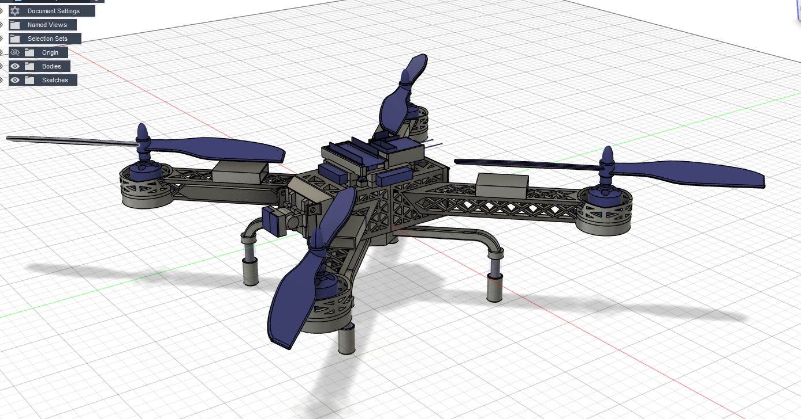 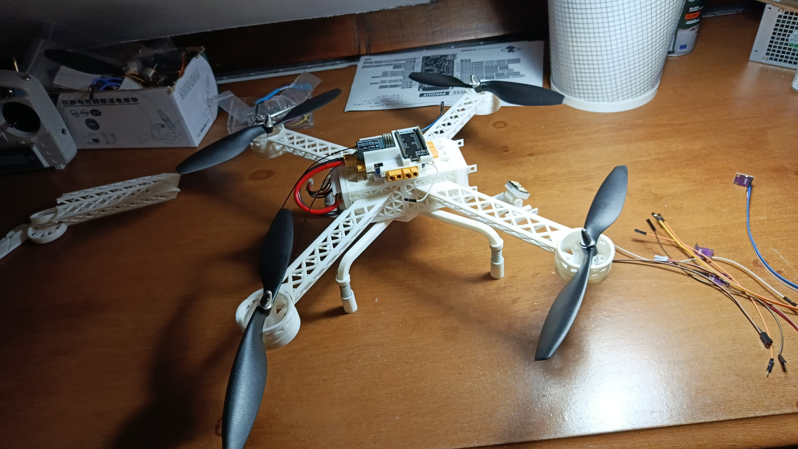  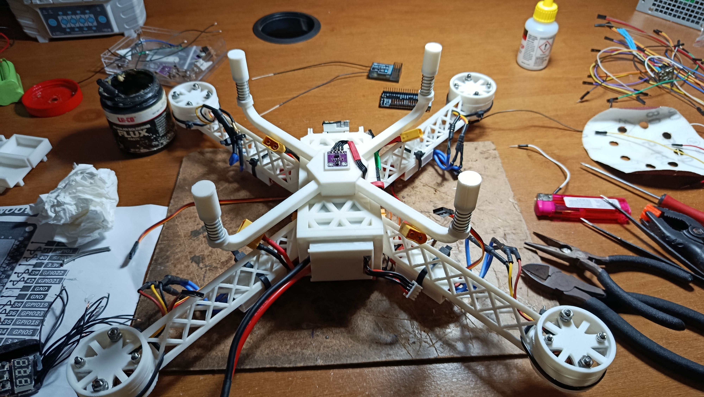

## Recept
Another quite large project, this is the reciever end of the FPV system for the custom flight controller: https://github.com/CircuitGuy943/Recept-5GHz-FPV-Reciever

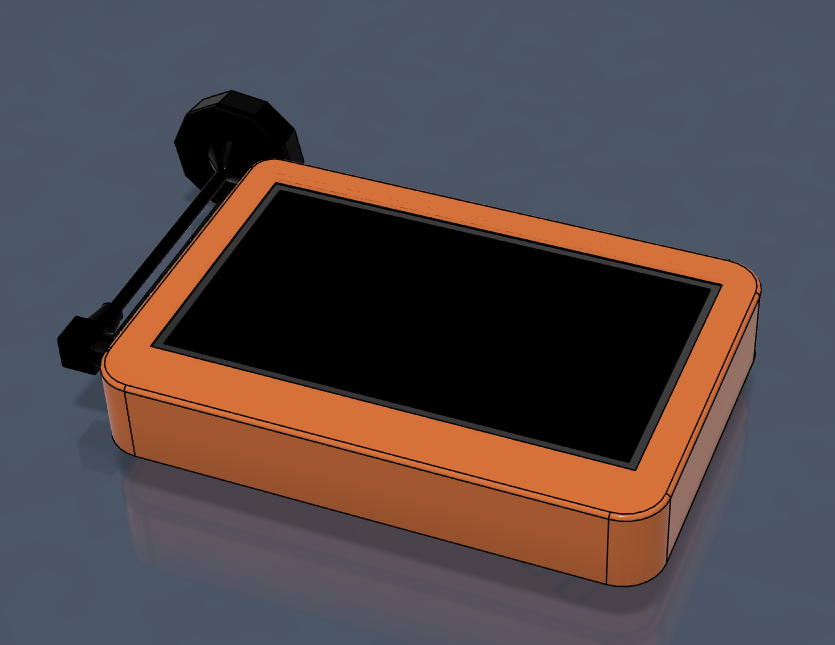 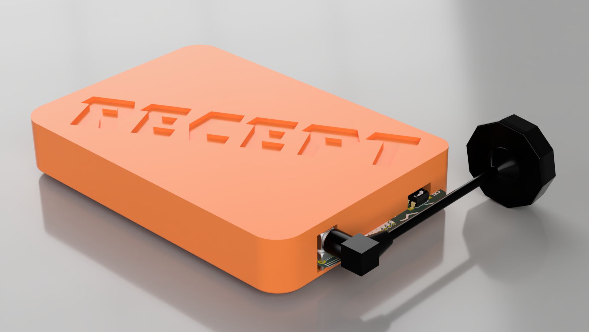 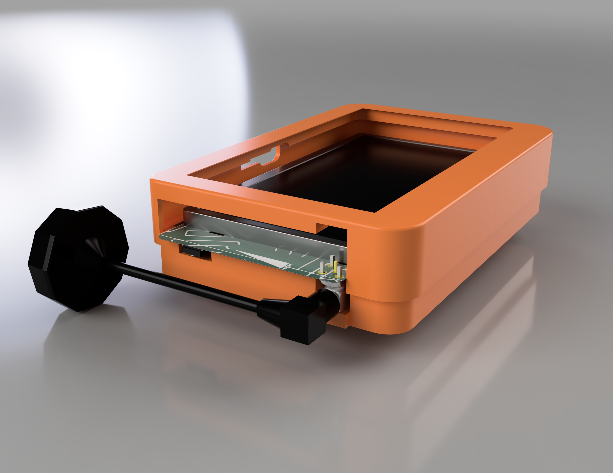 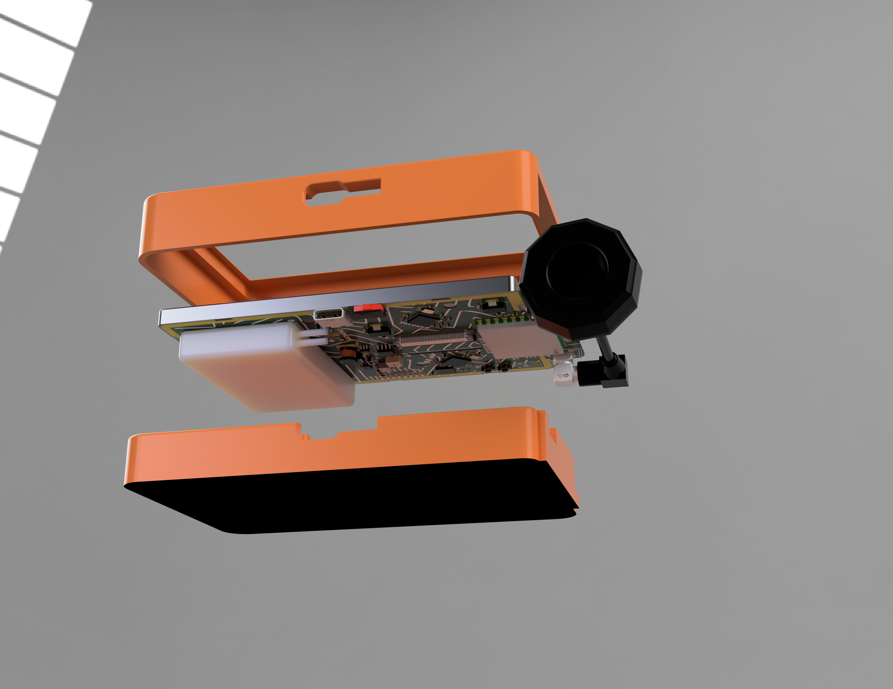 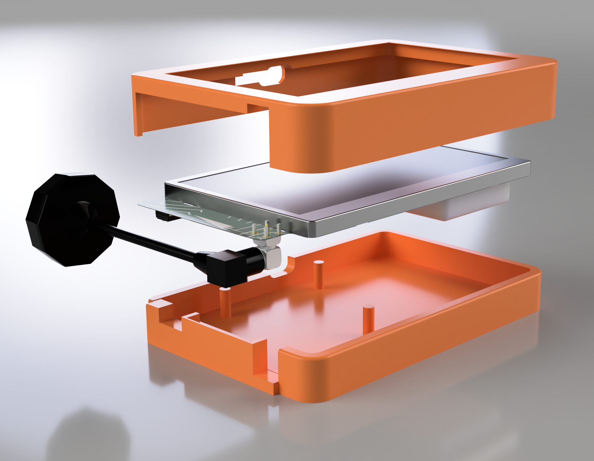 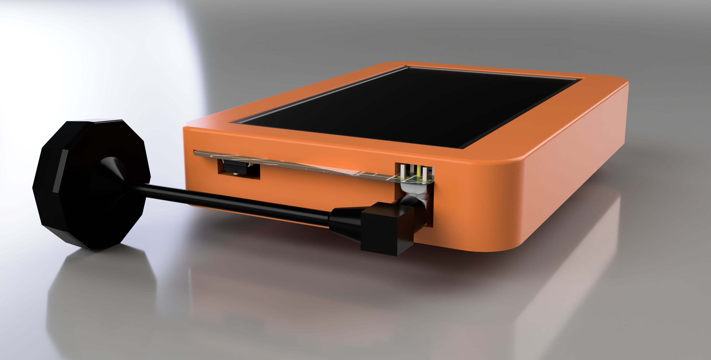 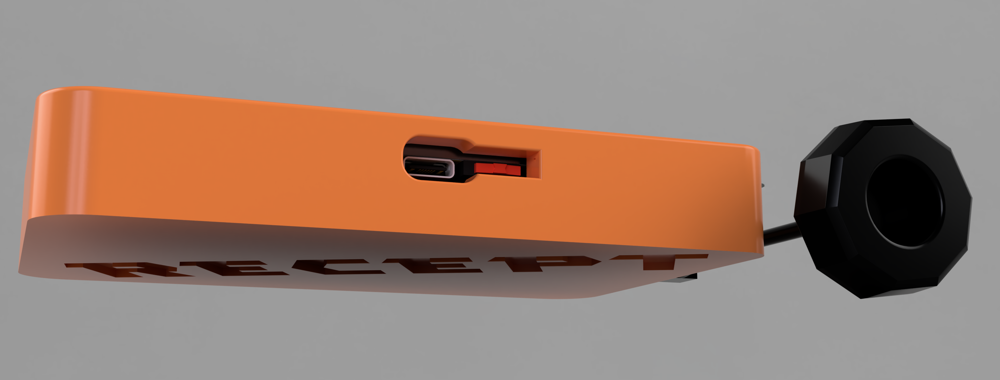 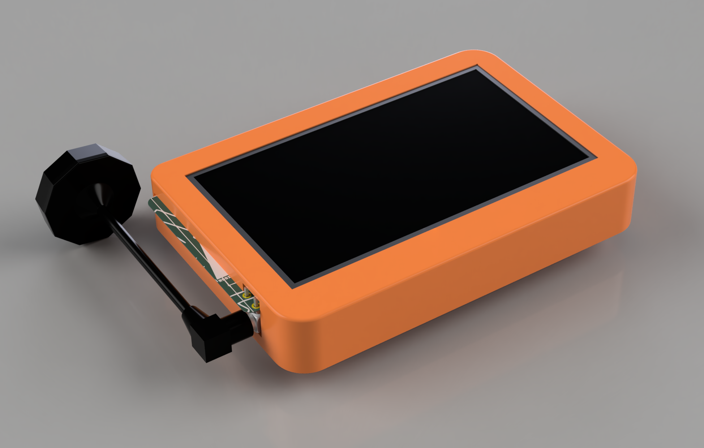  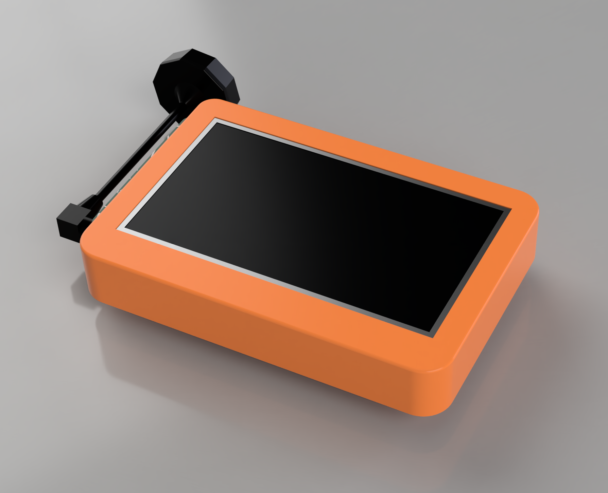  

## Soldering Iron Stand
Quick project where I made myself a soldering iron stand as my iron didn't already come with one, and while I was there I added lots of other features on it too: https://github.com/CircuitGuy943/Soldering-Iron-Holder

      

